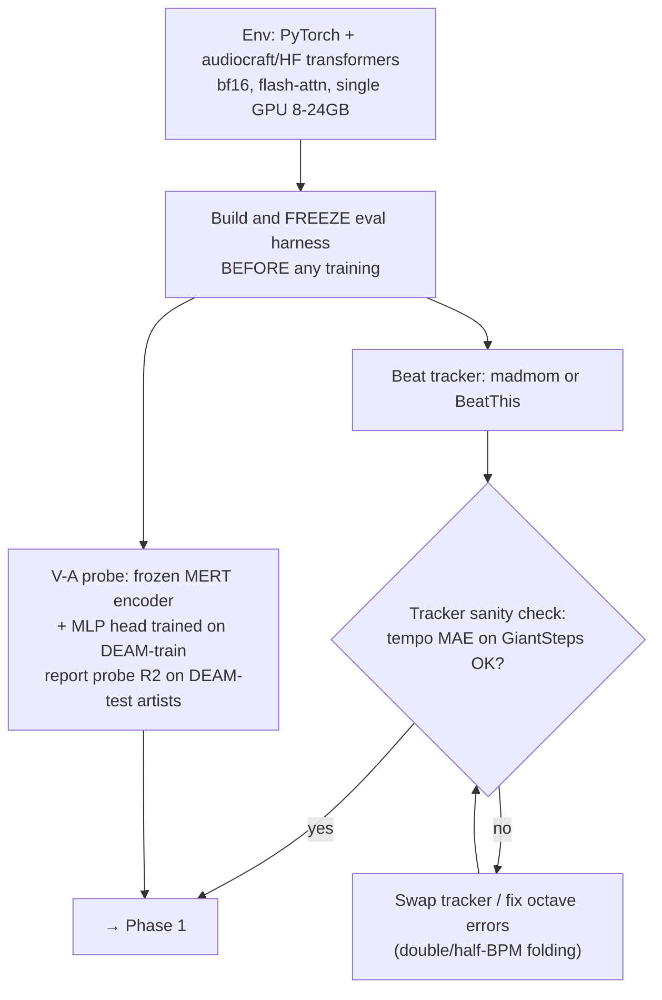
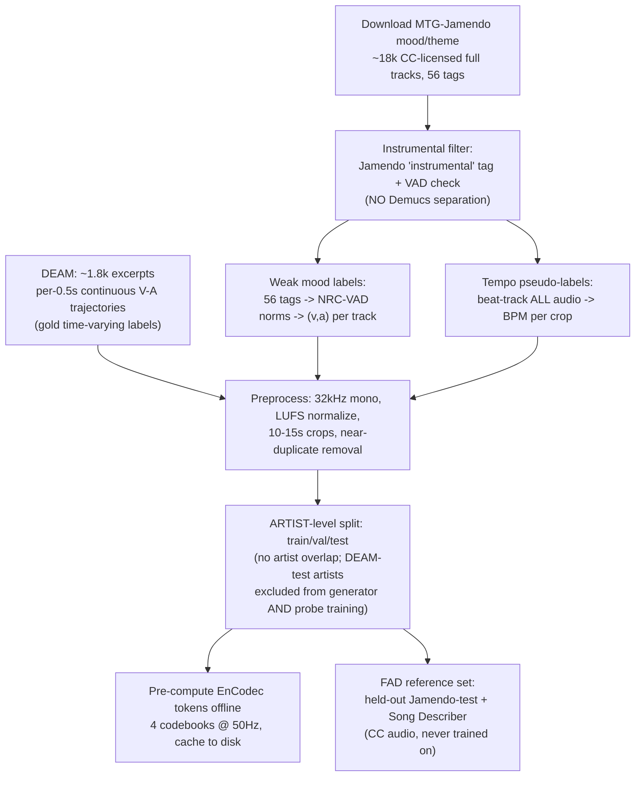
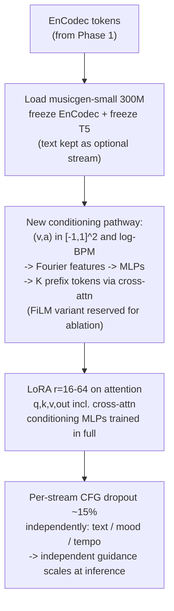
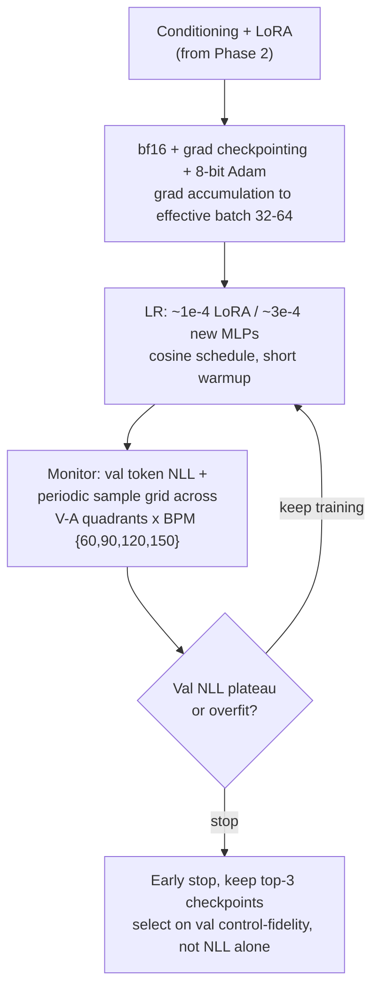
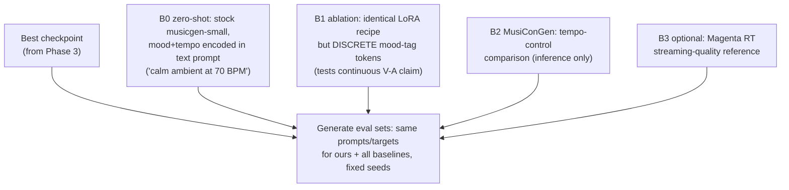
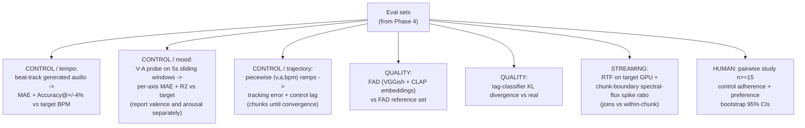
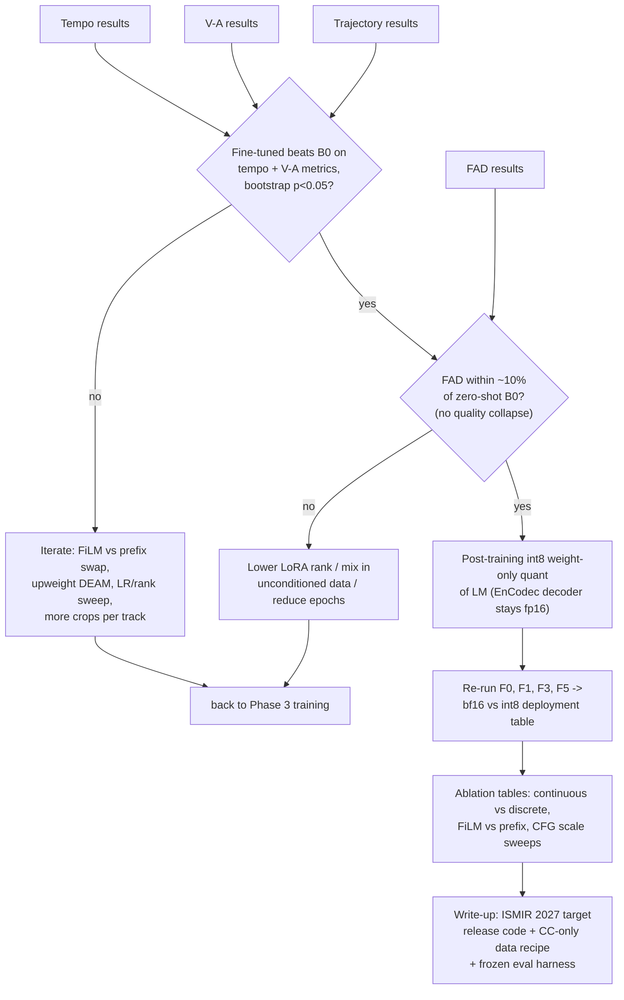

# audio-generation (Feature D)

Context-conditioned ambient music generation for Web2Music. Feature D turns a
page-mood profile (Handoff-2) into a short, seamlessly-loopable instrumental
clip.

> **Status — conditioning model is being fine-tuned.**
> The original backend fed `facebook/musicgen-small` a text prompt rebuilt from
> discrete mood tags. That path is retained as a baseline (`B0`), but the
> primary generator is now a **LoRA-fine-tuned MusicGen conditioned directly on
> continuous valence–arousal + tempo**, which removes the mood-taxonomy
> mismatch and unreachable-mood degradation documented in the roadmap (X1).
> This upgrades D from "substrate" to a co-contribution — see
> [Scope & venue note](#scope--venue-note).

---

## Fine-tuning track — full pipeline

Seven phases, run mostly in order (Phase 0 is a hard prerequisite; everything
downstream loops back into Phase 3 if the decision gates in Phase 6 fail). Each
phase is broken out below as its own diagram, in the order they execute.

### Phase 0 — Setup and eval harness first



The eval harness — the V-A probe and the beat tracker — is built and **frozen
before a single training run starts**, and the beat tracker is sanity-checked
against GiantSteps before it's trusted for anything downstream (an
octave/double-BPM error here silently corrupts every tempo-pseudo-label and
every tempo metric later). Building the ruler before the thing it measures is
the whole point of this phase — it stops "control fidelity improved" from
secretly meaning "the eval code changed."

### Phase 1 — Data pipeline



Jamendo supplies volume (weak `(v,a)` labels via NRC-VAD, tempo via the
now-validated beat tracker); DEAM supplies quality (gold, continuous,
time-varying V-A — this is what makes the *trajectory* control claim
possible). Both funnel into one preprocessing step, then an **artist-level**
split — not track-level, because a single Jamendo artist's tracks all sound
alike and a track-level split would leak style across train/test. DEAM-test
artists are held out of *both* generator and probe training so the eval isn't
grading itself. EnCodec tokens are cached offline so training doesn't re-run
the frozen audio codec every step.

### Phase 2 — Model surgery



The base model is frozen almost everywhere: EnCodec and T5 don't move at all.
What's new is a small conditioning encoder that turns `(v, a, log-bpm)` into
prefix tokens the model attends to, plus LoRA adapters on attention so the
backbone can actually respond to that new signal without a full fine-tune.
Per-stream CFG dropout is what later lets inference dial mood strength, tempo
strength, and text strength independently instead of one shared guidance
scale.

### Phase 3 — Training loop



Standard efficient-training recipe (bf16, checkpointing, 8-bit optimizer) with
one deliberate deviation: checkpoint selection is **not** driven by
validation loss alone. A model can have great NLL and still ignore the
conditioning signal, so the sample grid (across V-A quadrants and a few BPMs)
and the frozen eval harness from Phase 0 pick the checkpoint, not the loss
curve.

### Phase 4 — Baselines



Every baseline generates from the **same prompts/targets and fixed seeds** as
the fine-tuned model — no metric here is meaningful without that. `B0` is the
honest "did fine-tuning help at all" comparison (today's shipped system).
`B1` is the load-bearing one: identical LoRA recipe but discrete mood tags
instead of continuous `(v,a)`, which isolates *"continuous conditioning
specifically helps"* from *"any fine-tuning helps."*

### Phase 5 — Frozen eval (test-artist audio only)



Three metric families, all computed with the Phase-0-frozen tools: **control**
(does the audio actually hit the requested tempo/mood/trajectory — this is the
paper's core claim), **quality** (did control come at the cost of sounding
worse, via FAD/tag-KL), and **streaming** (is it fast enough to deploy). The
human pairwise study is the final sanity check that the automatic metrics
track what listeners actually perceive.

### Phase 6 — Decision gates



Two gates, checked in order, each with its own fallback loop back into
training rather than a silent "ship it anyway": **Gate A** asks whether
fine-tuning actually improved control (with a significance test, not just a
higher mean); **Gate B** asks whether that improvement came at the cost of
audio quality. Only a model that clears both gets quantized and written up —
quantization is a deployment ablation, never a way to dodge Gate B.

### Dataset roles (reference)

| Dataset | Role |
|---|---|
| MTG-Jamendo mood/theme | Main training corpus |
| DEAM | Time-varying V-A labels + probe training + gold eval |
| GiantSteps Tempo | Beat-tracker sanity check **only** |
| Song Describer | FAD reference (clean CC) |
| PMEmo | Optional external eval only |
| EMOPIA | Optional piano-only case study |

---

## Why fine-tune instead of prompting stock MusicGen

The stock path had three structural problems, not just bugs:

- **Taxonomy mismatch.** Feature B emits 11 moods; the old `d2_prompt.py`
  instrument map covered 6, so 7 moods silently collapsed to "ambient pads" and
  two were unreachable. Passing **continuous `(valence, arousal)` coordinates**
  removes the discrete map entirely — there is nothing left to mismatch.
- **Lossy prompt rebuild.** D discarded B4's engineered prompt and rebuilt a
  weaker one. A conditioned model consumes the affect/tempo signal as native
  inputs, so no prompt-rebuild step can drop instruments/timbre/reverb tags.
- **No tempo control.** Text prompts like "80 bpm" are only loosely honored.
  Explicit **log-BPM conditioning** makes tempo a first-class, measurable
  control (see [Evaluation](#evaluation)).

Text is retained as an **optional auxiliary conditioning stream**, not the
primary channel.

---

## Architecture

```
Handoff-2  ──▶  conditioning encoder  ──▶  fine-tuned MusicGen (LoRA)  ──▶  EnCodec decode  ──▶  loop + export
(v, a, bpm,     Fourier feats → MLP →       frozen EnCodec + T5,             32 kHz mono          d4_process.py
 duration,      K prefix tokens             LoRA on attn (incl. cross-attn)
 optional text)                             conditioning MLPs trained full
```

- **Base:** `facebook/musicgen-small` (300M). EnCodec tokenizer is **frozen**
  (32 kHz, 4 codebooks @ 50 Hz → ~50 autoregressive steps per second of audio).
  T5 text encoder frozen.
- **Conditioning encoder:** `(v, a) ∈ [-1, 1]²` and `log(BPM)` → Fourier
  features → small MLPs → `K` prefix tokens injected via cross-attention. A FiLM
  variant is kept as an ablation row.
- **Adapter:** LoRA (`r = 16–64`) on attention projections including
  cross-attention; the new conditioning MLPs are trained in full at a higher LR.
  DoRA is available as a same-cost drop-in row.
- **Guidance:** per-stream classifier-free-guidance dropout (~15%) applied
  independently to text / mood / tempo, yielding independent guidance scales at
  inference.

Fine-tuning strategy is an **ablation, not an assumption** — the tuning track
compares conditioning-only (frozen backbone) → LoRA/DoRA → cross-attn-only
unfreeze → full FT, selected on control-fidelity metrics.

---

## Handoff-2 input contract

Replaces the ad-hoc camelCase/snake_case forwarding that caused X1. Validated on
both the producer (Feature B) and consumer (`d1_validate.py`) sides against a
single JSON schema.

```jsonc
{
  "handoff_version": "2.0.0",
  "valence": 0.42,          // [-1, 1], positive = positive affect (X3 fixed)
  "arousal": -0.15,         // [-1, 1]
  "bpm": 72,                // target tempo; model conditions on log(bpm)
  "duration_s": 20,         // now honored end-to-end (was hardcoded ~5.1 s)
  "seed": 1234,             // logged for reproducibility
  "text": "warm reading-room ambience",  // OPTIONAL auxiliary stream
  "guidance": { "mood": 3.0, "tempo": 3.0, "text": 1.5 },
  "content_category": "longform_reading" // snake_case, single source of truth
}
```

Note: `valence` follows **positive-as-positive** everywhere. The inverted
`valenceHint` in the tier-2 classifier prompt (X3) is corrected upstream; do not
re-flip it here.

---

## Datasets (fine-tuning)

| Dataset | Role | Notes |
|---|---|---|
| **MTG-Jamendo** (mood/theme subset) | Main training corpus | ~18k CC-licensed full tracks. Filter to instrumental via the `instrumental` tag + a vocal-activity check — **no Demucs separation** (artifacts leak into training). |
| **DEAM** | Time-varying V-A labels · probe training · gold eval | Per-0.5s continuous valence/arousal; the source of the *time-varying* control claim. |
| **NRC-VAD norms** | Weak-label mapping | Jamendo mood tags → `(v, a)` for the training corpus. |
| **GiantSteps Tempo** | Beat-tracker sanity check **only** | Not training data — validates the pseudo-labeler's tempo MAE. |
| **Song Describer Dataset** | FAD reference set | Clean CC audio, never trained on. |
| **PMEmo** | External eval only | Secondary; murkier licensing. |
| **EMOPIA** | Optional piano-only case study | Clean single-instrument control. |

Tempo labels for the whole corpus are pseudo-labeled with `madmom` / `BeatThis`.
**Split by artist, not by track** — Jamendo artists have consistent styles and
track-level splits leak. DEAM-test artists are excluded from both generator and
V-A-probe training.

EnCodec tokens are pre-computed offline and cached to disk.

---

## Fine-tuning pipeline

Build and **freeze the eval harness before training anything** (see roadmap
Phase 0). Then:

```bash
# 0. env
pip install -r requirements.txt            # pinned; includes audiocraft/transformers, peft

# 1. data prep (instrumental filter, weak V-A labels, tempo pseudo-labels, EnCodec caching)
python -m data.prepare --config configs/data_jamendo_deam.yaml

# 2. train (bf16, grad checkpointing, 8-bit Adam, grad-accum to eff. batch 32–64)
python -m train.finetune --config configs/lora_r32.yaml

# 3. sweep the tuning-strategy ablation
python -m train.finetune --config configs/{cond_only,lora_r32,dora_r32,crossattn_only,full_ft}.yaml
```

Hyperparameters (starting point): LR ~1e-4 (LoRA) / ~3e-4 (new MLPs), cosine
schedule with short warmup, effective batch 32–64. Monitor validation token NLL
**plus** a periodic sample grid across V-A quadrants × BPM {60, 90, 120, 150};
select checkpoints on **val control-fidelity, not NLL alone**.

Skip QLoRA at 300M (weights ~0.6 GB in bf16; LoRA fits 8 GB comfortably).
Revisit only if moving to `musicgen-medium` on the low-VRAM end.

---

## Evaluation

Run against **test-artist audio only**, with the frozen harness. Every system
(fine-tuned + all baselines) generates from identical prompts/targets and fixed
seeds.

**Control fidelity (the "fine-tuning improves performance" claim)**
- **Tempo:** beat-track generated audio → MAE + Accuracy@±4% vs target BPM.
- **Mood:** MERT-encoder V-A probe on 5s sliding windows → **per-axis** MAE + R²
  (report valence and arousal separately — valence is measurably harder to
  control than arousal).
- **Trajectory:** piecewise `(v, a, bpm)` ramps → tracking error + control lag
  (chunks-until-convergence).

**Quality**
- **FAD** (VGGish *and* CLAP embeddings) vs the Song Describer reference set.
- **CLAP score** (prompt adherence, for the text-conditioned rows).
- Tag-classifier KL divergence vs real audio.

**Streaming / deployment**
- Real-time factor on the target GPU.
- Chunk-boundary spectral-flux spike ratio (loop joins vs within-clip).

**Baselines**
- `B0` zero-shot stock MusicGen with mood+tempo in the text prompt.
- `B1` identical LoRA recipe but **discrete mood-tag tokens** (isolates the
  continuous-V-A claim from "any fine-tuning helps").
- `B2` MusiConGen (tempo-control comparison, inference only).
- `B3` Magenta RealTime (streaming-quality reference).

**Decision gates:** ship only if the fine-tuned model beats `B0` on tempo + V-A
with bootstrap `p < 0.05` **and** FAD stays within ~10% of `B0` (no quality
collapse). Quantization is evaluated only *after* both gates pass.

The four `experiments/` stubs map onto these tables:
`d1_prompt_ablation.py`, `d2_loop_test.py`, `d3_clip_length.py`,
`d4_latency.py`.

---

## API

`POST /generate` — accepts a Handoff-2 body, returns clip + loop metadata.

- Generation runs on GPU in fp16 (`device="cuda"`, `torch_dtype=float16`) and is
  offloaded off the event loop (`await asyncio.to_thread(...)`) so one request
  can't stall the server.
- `duration_s` is honored (was previously fixed at ~5.1s). Quality degrades past
  the ~30s training window (~1500 tokens); for longer output use MusicGen
  audio-continuation (feed the tail back as an audio prompt).
- `seed` is logged with every generation for reproducibility; sampling is
  otherwise `do_sample=True`.
- **Cache key must include** `(v, a, bpm, duration_s, seed, guidance)` — not the
  text prompt. The old key collided distinct requests (e.g. different musical
  keys) into one clip.
- `/generate` has no auth/rate-limiting yet; each call is GPU-minutes, so this is
  a cost-DoS surface — noted in the deployment/limitations discussion.

Optional `int8` weight-only quantization of the LM is available for the RTF
table; **keep the EnCodec decoder in fp16** (codec-decoder quantization is where
artifacts become audible). Re-run tempo/V-A/FAD after quantizing.

---

## Looping & export (downstream of generation — still required)

Fine-tuning improves *what* is generated, not *how* it loops. The roadmap's X2
and gapless-export fixes remain in scope:

- Real loop-point detection: start the self-similarity search past a minimum
  loop length (≥2–4s), `nan_to_num`, vectorize, **snap to bar boundaries**, and
  use an **equal-power crossfade** head→tail (not `fade_out(50)`, which is
  audible on every repeat).
- Export **WAV or Ogg/Opus** (Opus is gapless); MP3 encoder delay/padding causes
  an audible seam even after a perfect cut. Alternatively decode into a Web Audio
  `AudioBufferSourceNode` with `loopStart`/`loopEnd` from `loop_point_ms`.

---

## Reproducibility

- Pinned `requirements.txt` (Python) + pinned model IDs (HF revision).
- Released training/eval configs, seeds, prompts, and the frozen eval harness.
- `research_log.md` is the running lab notebook (data versions, run IDs,
  metric deltas).

---

## Limitations

- **License:** MusicGen weights are CC-BY-NC 4.0 — fine for research, blocks
  commercial deployment. Must appear in the artifact/limitations statement.
- **Base-model ceiling:** `musicgen-small` quality ceiling; ~30s training-window
  constraint.
- **Valence < arousal controllability:** expect a per-axis asymmetry in control
  fidelity; report both axes rather than an average.
- **Weak training labels:** tag→V-A mapping via NRC-VAD is approximate; DEAM
  provides the gold continuous labels for eval.

---

## Scope & venue note

With stock MusicGen, Feature D is engineering and the paper's contribution is the
web-context→music pipeline + user study (IUI / ACM Multimedia). Adding a
mood/tempo-conditioned fine-tuned model makes the **audio-loop / conditioning
contribution** citable in its own right, which is what puts ISMIR / DAFx /
ICASSP in reach. Decide deliberately whether D is a co-contribution or stays
substrate — doing the fine-tuning *and* under-claiming it in the write-up is the
worst of both.
